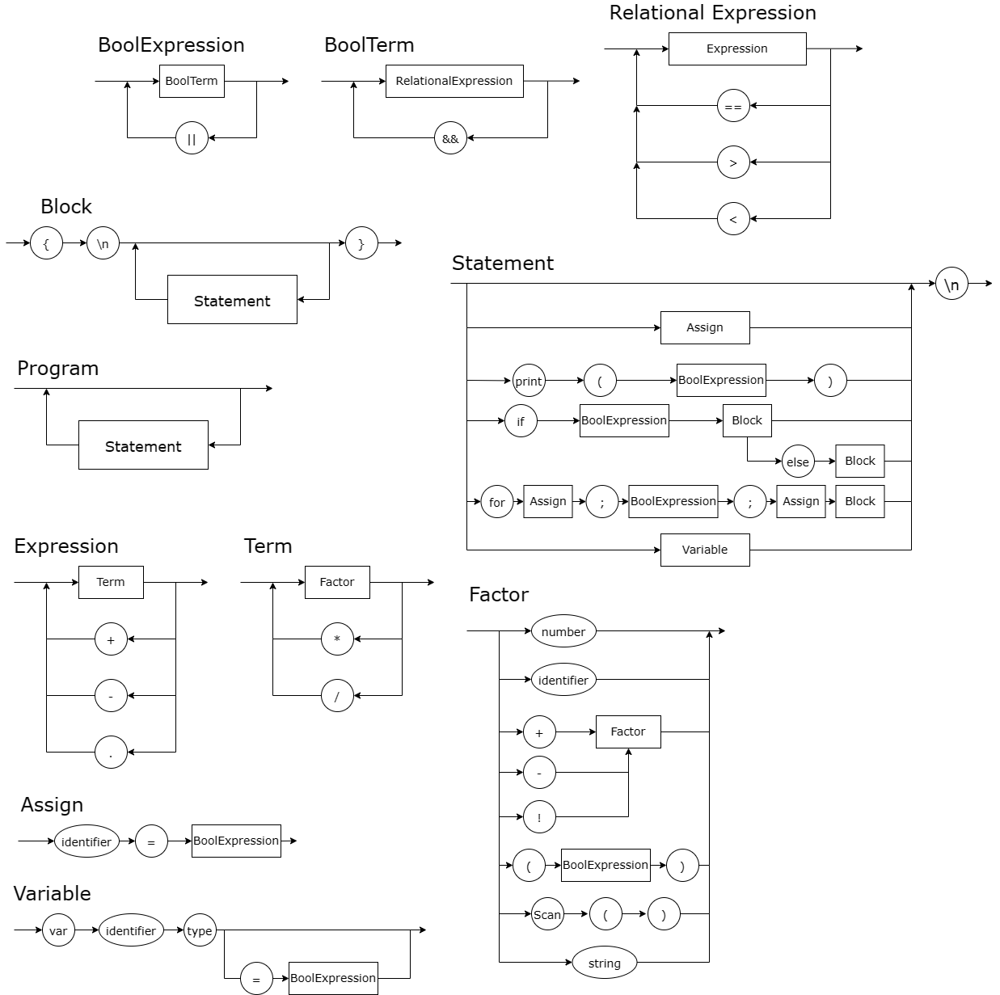

# Status dos testes


# Diagrama Sintatico


# EBNF
```c
BLOCK = { STATEMENT };
STATEMENT = ( λ | ASSIGNMENT | PRINT | IF | FOR), "\n" ;
ASSIGNMENT = IDENTIFIER, "=", EXPRESSION ;
PRINT = "Println", "(", EXPRESSION, ")" ;
IF = "if", BOOLEXPRESSION, BLOCK, {λ | "else", BLOCK} ;
FOR = "for", ASSIGNMENT, ";", BOOLEXPRESSION, ";", ASSIGNMENT, BLOCK;
BOOLEXPRESSION = BOOLTERM, { ("||"), BOOLTERM } ;
BOOLTERM = RELATIONALEXPRESSION, { ("&&"), RELATIONALEXPRESSION } ;
RELATIONALEXPRESSION = EXPRESSION, { ("==" | ">" | "<"), EXPRESSION } ;
EXPRESSION = TERM, { ("+" | "-"), TERM } ;
TERM = FACTOR, { ("*" | "/"), FACTOR } ;
FACTOR = (("+" | "-" | "!"), FACTOR) | NUMBER | "(", BOOLEXPRESSION, ")" | IDENTIFIER | SCAN ;
IDENTIFIER = LETTER, { LETTER | DIGIT | "_" } ;
NUMBER = DIGIT, { DIGIT } ;
LETTER = ( a | ... | z | A | ... | Z ) ;
DIGIT = ( 1 | 2 | 3 | 4 | 5 | 6 | 7 | 8 | 9 | 0 ) ;
SCAN = "Scanln", "(", ")" ;
```
